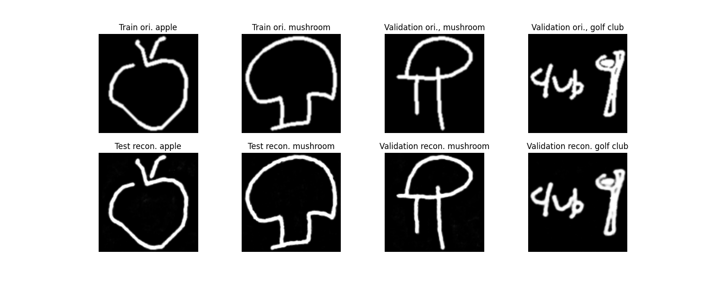
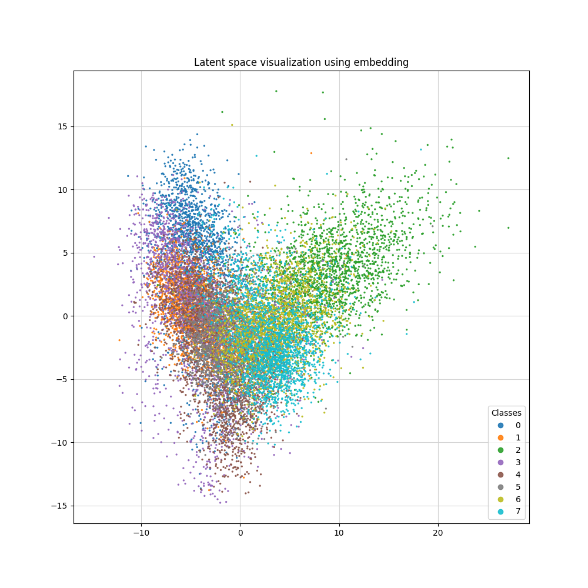
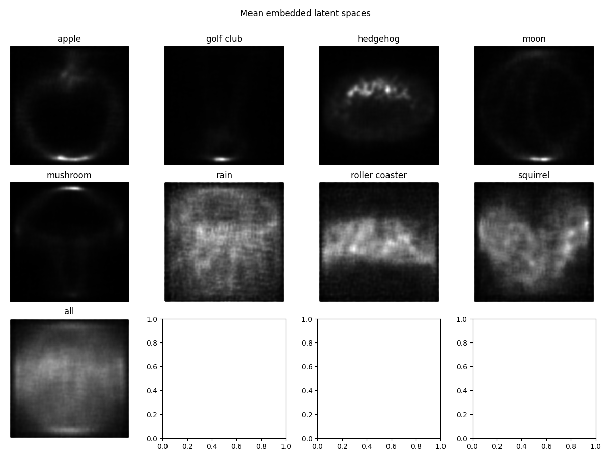
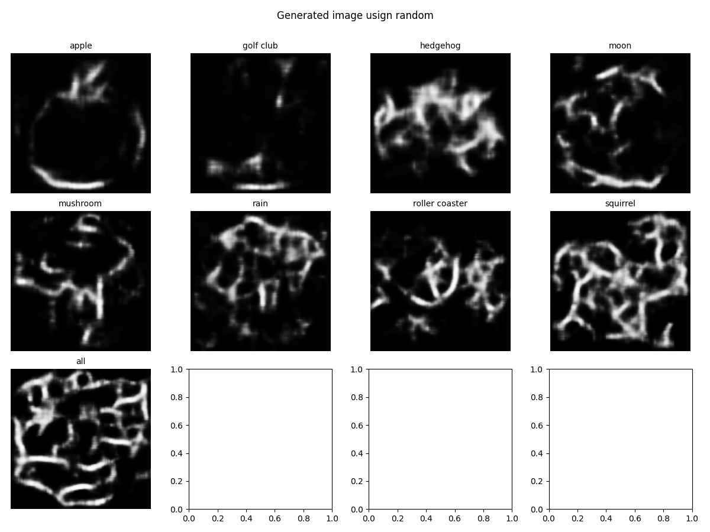
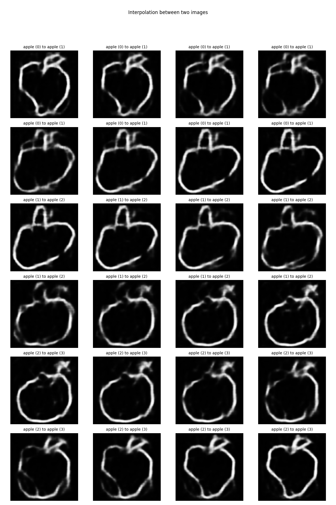

# Computer vision project : Drawings manipulation

This repository is our work for the computer vision project on the IA specialisation track proposed in the third year of study at ENSEIRB-MATMECA.

# Authors

[Maxence Bazin](https://mightycode.github.io/index-en.html)
[Nicolas Przybylski](https://sukuway.github.io/index.html)
Guillaume Rancillac

 

# Requirements 

- All python packages included in the requirements.txt
- The ffmpeg program installed

- Launch prior to other scripts, download_resource.py in order to dowload all the mandatory resources.

# Notebook and folder

In *dataset_creation* folder, you will find the code relative to the image dataset and images management.

In *resources* folder, a git ignored folder, you will find the mandatory resources and the json file needed to creates the images.

In *results* folder, a git ignored folder, you will find the created images by all the scripts.

In *src* folder, you will find all the model we used for our experiments.

In *utils* folder, you will find all the class and their static methods that create all the figures.

In *weights* folder, a git ignored folder, you will find all the saved model checkpoints information.

*download_resources.py* download two datasets to the resources folder, one with 28x28 images, one with pen strokes.

*class_detection.ipynb*, need resources, is a notebook that run a fixed cnn model that does classification on the data.

*encoder_decoder_strokes.ipynb*, need resources, is a notebook that lets the user filling information about the model he wants to run: model type, number of epochs, architecture, size of the images, etc ... 
Then it run the model, load the weights if the file exists, then do several experiment.

*create_images.py* is a script taking a json as argument. The json file describes the models we want to use. The script does the same experiments as above for encoder_decoder_strokes.ipynb and save the figures on the results/image folder. 

The experiments are : 
- Plotting the train curve
- Reconstructs images over the training and testing dataset
- Plotting the latent space
- Showing the reconstructed image from the mean latent vectors of each class
- Showing generation of images from the mean latent vectors
- Showing images reconstructed using embedding of other classes
- Several cases of interpolations

# Images examples :

**Reconstruction**

*convolutional model*

**Latent space**

*convolutional variational embedded model 2* (rl: 0.8, kl: 0.2)

**Reconstructed images from mean latent vectors**

*convolutional variational embedded model 2* (rl: 0.9, kl: 0.1)

**Generated images from mean vectors (using Normal random)**

*convolutional variational embedded model* (rl: 0.4, kl:0.6)

**Interpolation list of image**

*convolutional variational embedded model* (rl: 0.4, kl:0.6)

**Interpolation class to same class**

*convolutional variational embedded model* (rl: 0.4, kl:0.6)

**Interpolation class to other class**

*convolutional variational embedded model* (rl: 0.4, kl:0.6)